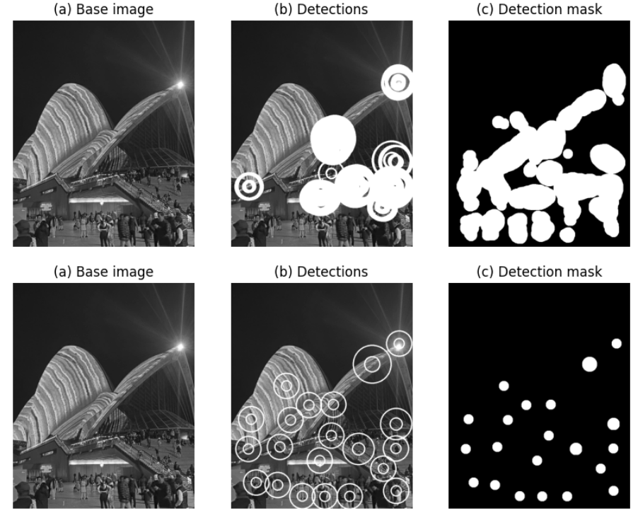

# Detection of converging areas using the _a contrario_ principle
This projects builds upon the article [_Detection of convergence areas in digital breast tomosynthesis using a contrario modeling_](https://www.semanticscholar.org/paper/Detection-of-convergence-areas-in-digital-breast-a-Palma-Muller/37f60bb9c90c5c1f0ca208c2d19329ba2806045c) and propose an implementation of the method, as well as a detection reduction approach using a masking principle

